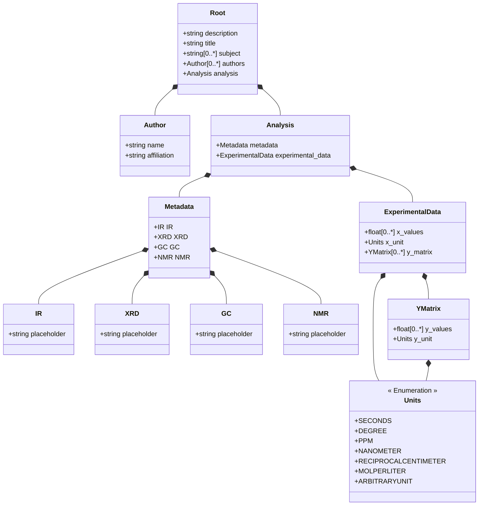

```mermaid
classDiagram
    Root *-- Author
    Root *-- Analysis
    Analysis *-- Metadata
    Analysis *-- ExperimentalData
    Metadata *-- IR
    Metadata *-- XRD
    Metadata *-- GC
    Metadata *-- NMR
    ExperimentalData *-- Units
    ExperimentalData *-- YMatrix
    YMatrix *-- Units
    
    class Root {
        +string description
        +string title
        +string[0..*] subject
        +Author[0..*] authors
        +Analysis analysis
    }
    
    class Author {
        +string name
        +string affiliation
    }
    
    class Analysis {
        +Metadata metadata
        +ExperimentalData experimental_data
    }
    
    class Metadata {
        +IR IR
        +XRD XRD
        +GC GC
        +NMR NMR
    }
    
    class IR {
        +string placeholder
    }
    
    class XRD {
        +string placeholder
    }
    
    class GC {
        +string placeholder
    }
    
    class NMR {
        +string placeholder
    }
    
    class ExperimentalData {
        +float[0..*] x_values
        +Units x_unit
        +YMatrix[0..*] y_matrix
    }
    
    class YMatrix {
        +float[0..*] y_values
        +Units y_unit
    }
    
    class Units {
        << Enumeration >>
        +SECONDS
        +DEGREE
        +PPM
        +NANOMETER
        +RECIPROCALCENTIMETER
        +MOLPERLITER
        +ARBITRARYUNIT
    }
    
```